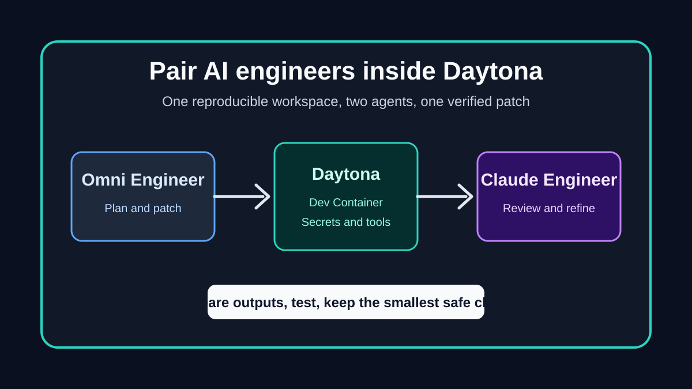

# Pair Omni and Claude Engineers in Daytona

AI coding agents are most useful when they work inside the same constraints as
the developer who will review their work. They need the real repository, the
real dependency installation path, the same environment variables, and the same
test commands. Without that shared setup, an agent can produce convincing code
that only works in an imagined workspace.

Daytona gives this workflow a better default. A repository can describe its
tools with a Dev Container, then any contributor can start a clean workspace
with the same Python version, package manager, command-line tools, and editor
extensions. That is especially helpful when comparing AI coding tools, because
the environment is no longer the hidden variable. Omni Engineer and Claude
Engineer can inspect the same issue, run from similar containers, and produce
patches that are easier to compare.



This guide shows a practical paired AI engineering workflow: open Omni Engineer
and Claude Engineer in Daytona, give them the same small task, compare their
output, and keep only one validated patch. The goal is not to merge whatever an
agent writes first. The goal is to use two agents as reviewers and implementers
inside a reproducible workspace, then make a normal engineering decision.

## Prepare the AI engineer repositories

The first step is making both projects convenient to open in Daytona. Dev
Container support has been proposed for both upstream repositories:

- [Omni Engineer Dev Container pull request](https://github.com/Doriandarko/omni-engineer/pull/32)
- [Claude Engineer Dev Container pull request](https://github.com/Doriandarko/claude-engineer/pull/256)

Each configuration uses the official Python 3.12 Dev Container image and adds
the GitHub CLI feature. It installs the repository dependencies during
workspace creation, copies `.env.example` to `.env` when the example file is
available, and keeps API keys outside the repository by reading them from the
workspace environment.

That last point matters. AI engineering tools often need provider credentials,
but the Dev Container should never commit those secrets. In Daytona, add keys as
workspace environment variables or fill them into the local `.env` file after
the workspace is created.

For Omni Engineer, useful environment variables may include:

```bash
OPENROUTER_API_KEY=your_openrouter_key
ANTHROPIC_API_KEY=your_anthropic_key
OPENAI_API_KEY=your_openai_key
```

For Claude Engineer, the most important key is usually:

```bash
ANTHROPIC_API_KEY=your_anthropic_key
```

The exact provider choice depends on how you configure each tool, but the
workspace pattern stays the same: dependencies live in the container, secrets
live in Daytona or `.env`, and the repository stays clean.

## Create both Daytona workspaces

After the Dev Container changes are available from a branch or merged upstream,
create the first workspace for Omni Engineer:

```bash
daytona create https://github.com/Doriandarko/omni-engineer
```

Open the workspace terminal and confirm the dependencies installed correctly:

```bash
python --version
python -m pip show typer rich || true
```

Then run the project entrypoint:

```bash
python main.py
```

Create the second workspace for Claude Engineer:

```bash
daytona create https://github.com/Doriandarko/claude-engineer
```

The Claude Engineer container installs `uv` and syncs the project when possible.
Confirm the runtime and start the tool:

```bash
python --version
uv run ce3.py
```

Running the tools in separate Daytona workspaces keeps their dependency graphs
isolated. It also makes the comparison fairer: both agents start from a fresh
workspace, both receive the same task, and neither inherits accidental local
state from the other.

## Give both agents the same task

Choose a task that is small enough to review. Good candidates include a failing
test, a missing error state, a documentation example that no longer runs, or a
bug with a clear reproduction command. Avoid asking the agents to redesign a
large feature at the same time. The paired workflow works best when the final
answer can be checked in minutes.

Use the same prompt for both agents. Include the repository goal, the failing
command, the expected behavior, and the validation command. For example:

```text
Investigate why `npm test -- --run auth-form` fails after the latest form
change. Keep the fix minimal. Do not refactor unrelated files. Explain the root
cause and run the focused test before proposing the final patch.
```

Ask Omni Engineer to produce a first-pass implementation. Then ask Claude
Engineer to solve the same task independently. If one agent is stronger at
finding the cause and the other is stronger at simplifying the patch, keep both
outputs available. The point is not to make them race. The point is to create
two candidate explanations and use them to make a better final change.

## Compare patches before choosing one

Once both agents finish, inspect their diffs like a normal code review:

```bash
git diff --stat
git diff
```

Look for the smallest change that explains the failure. A good patch usually
touches fewer files, has a clear reason, and comes with a validation command
that actually ran in the workspace. Be careful with patches that silently remove
tests, broaden types too far, or add new dependencies for a local bug.

When both agents solve different parts of the issue, combine the ideas manually
instead of merging both diffs blindly. For example, Omni Engineer may identify
the faulty state transition while Claude Engineer may suggest a clearer test
case. In that situation, keep the root-cause fix, add the targeted test, and
drop speculative cleanup.

The final check should happen in one clean Daytona workspace:

```bash
git status --short
npm test -- --run auth-form
npm run lint
```

Use the equivalent commands for the repository you are fixing. If a full test
suite is too slow, run the focused test first and document what was skipped.
That makes the pull request easier for maintainers to trust.

## Why Daytona improves the loop

The most common failure mode for AI-assisted coding is environment drift. The
agent describes a command that was never installed, edits code against a stale
dependency, or assumes a tool exists because it was present on the developer's
machine. Daytona reduces that risk by starting from a documented workspace.

This is also useful for maintainers. A pull request created from a Daytona
workspace can point to the Dev Container setup, the exact validation commands,
and the environment variables that must be supplied by the user. The review
conversation becomes less about reproducing the contributor's laptop and more
about whether the patch is correct.

Paired AI engineering does not remove the need for review. It makes review
more informed. Two agents can generate different explanations, but only the
validated patch should survive. Daytona provides the repeatable workspace where
that decision can be made quickly and safely.

## Reference workflow

Use this checklist when trying the process on a real issue:

1. Open Omni Engineer and Claude Engineer from Daytona workspaces.
2. Add provider keys through Daytona secrets or local `.env` files.
3. Give both agents the same small, testable task.
4. Compare explanations before comparing code.
5. Keep the smallest patch that addresses the root cause.
6. Run the focused test, lint, and any relevant build command.
7. Submit the pull request with the issue link, validation output, and notes
   about any command that could not be run.

That loop keeps AI assistance useful without turning the final pull request
into an unreviewed bundle of generated code. The agents help explore and draft.
Daytona keeps the environment reproducible. The developer still ships the
patch that can be explained, tested, and maintained.
